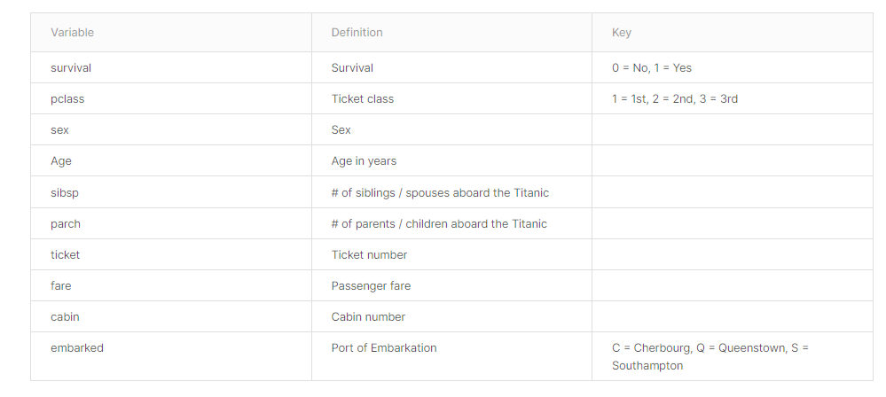
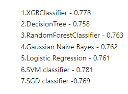

# DS-Project-8-Titanic_Survival_Predictor
Engineered a model that predicts which passengers survived the Titanic shipwreck disaster.

* Designed a model that predicts the chances of survival in the Titanic shipwreck disaster. Data Science can help us understand what can help people in a dire situation and how these situations can be prevented. It allows us to be somewhat prepared for even inevitable situations. 
* Dataset - Part of a Kaggle competition. The training dataset consists of features some of which are passengers’ gender and class. For each passenger in the test set,  we have to predict whether or not they survived the sinking of the Titanic.
* Model - As some element of luck was involved in surviving, where some groups of people were more likely to survive than others,our objective is to predict what are the factors that helped them survive this disaster.
## Code and Resources Used ##
**Python Version:** 3.10.5  
**Packages:** pandas, numpy, sklearn, matplotlib, xgboost  
**For Web Framework Requirements:** _pip install -r requirements.txt_  
**Data Resources:** <https://www.kaggle.com/competitions/titanic>

## About the Dataset ##
The data has been split into two groups:  
- training set (train.csv)
- test set (test.csv)

Including the ground truth which is if the passenger 'survived' or not , the training dataset consists of categorical and numerical attributes related to passenger information. The test dataset contains the information on which we evaluate our model on, it doesn't consist of the ground truth as that is what we have to predict.  
Below is an overview of the attributes.  

#### Data Overview ####

## EDA - Exploratory Data Analysis and Data Pre-Processing ## 

1. First , I check for null values present in the dataset. Attributes with very high percentage of null values are dropped as they would harm the model.
2. I also drop the attributes that are unique and have no consequences on the chances of survival of a passenger such as the PassengerId.
3. As for filling the attributes that have a low percentage of null values, I use median and mode appropriately. This was a quick approach to solving this issue.

## Feature Engineering ##
Coming up with some new attributes for the model to intepret behaviours for better predictions.

- FamilySize - Size of family. 1 represent that the passenger was travelling alone.
- Title - The indivuals title indicating social status. Since we got too many titles that are very few in numbers, they could affect the model and we dont want that. Therefore we categorize them under one name which will be represented as 'unique'.
- Farebin and Agebin - Binning the values to reduce the impact of minor observation errors. It also takes care of some outliers.  
**Binning basically refers to compressing/bucketing the data in ranges to simplify it.**

Finally, we dummify Categorical features which is the process of representing the categorical features as numerical which is ideal for my model and split the dataset into training and testing sets.

## Model Building ##
I train the data on a number of different classifiers while using  GridSearchCV method to perform cross validation and fine tune it based on tuning the hyperparameters.  
As for my scoring metric, I decided to go with F1-scores as I believe it is one of the best ways to evaluate a classifier.  

After tuning the hyperparameters for different classifiers, the F1-scores for the classifiers were as follows:
 

Even though the SVM Classifier performed the best on the test dataset, the XGB Classifier outperformed it while training with the training dataset.

## XGBClassifier ##
XGBoost is a popular and efficient open-source implementation of the gradient boosted trees algorithm. Gradient boosting is a supervised learning algorithm, which attempts to accurately predict a target variable by combining the estimates of a set of simpler, weaker models. It's fast as it has the capacity to do parallel computation on a single machine.

**Hyperparameter Tuning**
The hyperparameters were chosen according to my preferences. You can makes changes to this after researching more about it.  
   - "max_depth" : list(range(1,5)) --> This is the maximum depth that you allow the tree to grow to. The deeper you go, the more complex your model will become.
   - "n_estimators" : list(range(1,5)) --> the number of runs XGBoost will try to learn
   - "learning_rate" : [0.01,0.1,1] --> The learning speed of the model

The results were average as most of the people in the competition managed to get a similar score with a F1-score of **0.778**.  
You could probably get a higher score with more detailed feature engineering.

